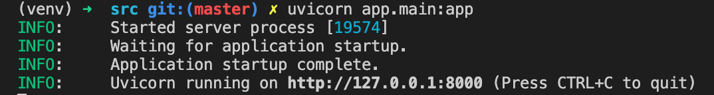
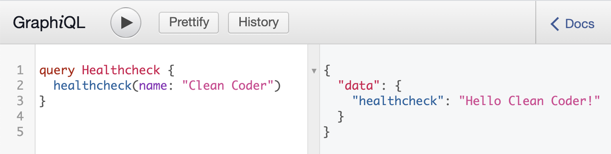

# 1. Basic FastAPI server with GraphQL in Docker

## Project structure

```
clean-architecture-python (repo root)
|
└- .git
|
└- src
|  └- app
|  |  └- __init__.py
|  |  └- main.py
|  |
|  └- docs
|  |
|  └- tests
|  |  └- conftest.py
|  |  └- test_healthcheck.py
|  |
|  └- venv
|  |
|  └- Dockerfile
|  └- requirements.txt
|
└- README.md
└- docker-compose.yml

```

## Setup the local Python environment

Create a folder to hold your project files and set up a Python virtual environment within that folder. Any version of Python between 3.7 and 3.9 should work.

```
$ mkdir clean-architecture-python
$ cd clean-architecture-python

$ mkdir src
$ cd src

$ python3.9 -m venv ./venv
$ source ./venv/bin/activate

(venv) $ pip install --upgrade pip
```

The last line updates the `pip` package manager to the latest available version to get rid of the pesky warnings when your default pip version is slightly out of date.

My shell decorates my prompt with the virtual environment that I am in. You can see that the last line starts with `(venv) $`. From here on in all commands are supposed to be executed within the Python virtual environment.

## Install dependencies

If you have checked out the repo you have a `requirements.txt` file with the dependencies of the project. In that case you can run a simple command to install all dependencies at once:

```
$ pip install -r requirements.txt
```

If you want to build up your environment along with the tutorial you have to install the requirements to run FastAPI and generate a `requirements.txt` file to pin the installed versions for a reproducible environment:

```
$ pip install fastapi
$ pip install uvicorn

$ pip freeze > requirements.txt
```

Keep your `requirements.txt` file up to date with future additions to the dependencies.

## A simple web app

Within `src` create the `app` folder and a file called `main.py` with the following content:

```python
# app/main.py
import os
from fastapi import FastAPI

app = FastAPI()

@app.get("/healthcheck")
async def healthcheck():
    return {
        "ping": "pong",
        "environment": os.getenv("ENVIRONMENT"),
    }
```

If you are familiar with other web frameworks you should recognize the format. First we create a new app instance, then add a simple handler for a GET request on '/healthcheck'. The handler returns "pong" and the value for the ENVIRONMENT env variable.

We can run this file from the command line and see our server in action. Run this command in the `src` folder after you have the local Python environment activated.

```
(venv) $ uvicorn app.main:app
```



You can see that the server starts by default on port 8000. To test our server use any HTTP client you are familiar with. Using `curl` for example we can crate a GET request like this:

```bash
$ curl http://localhost:8000/healthcheck
{"ping:"pong","environment":null}
```

The second line in the code above is the response from our server. The environment is currently unset so we receive `null`. It just works!

## Add GraphQL

First we need to add `graphene` to our Python dependencies:

```
(venv) $ pip install graphene
(venv) $ pip freeze > requirements.txt
```

Add new folders to `src/app` to create the following structure:

```
src/app
|
└- adapters
|  └- __init__.py
|  |
|  └- graphql
|     └- __init__.py
|     └- graphql_app.py
|     └- query.py
|
└- __init__.py
└- main.py
```

Add an `__init__.py` file to `src/app/adapters` and `src/app/adapters/graphql`. Then add the file `graphql_app.py` to `graphql` and add the following content:

```python
# src/app/adapters/graphql/graphql_app.py
import graphene
import starlette.graphql

from graphql.execution.executors.asyncio import AsyncioExecutor

from .query import Query

schema = graphene.Schema(query=Query)

class GraphQLApp(starlette.graphql.GraphQLApp):
    def __init__(self, *args, **kwargs):
        starlette.graphql.GraphQLApp.__init__(
            self,
            schema=schema,
            executor_class=AsyncioExecutor,
            *args,
            **kwargs,
        )
```

In this code we set up a GraphQL schema and define a custom GraphQLApp class based on Starlette GraphQLApp. To make it work with our async web app we have to set the `executor_class` to `AsyncioExecutor`.

Our schema only includes a `Query` which comes from `query.py`:

```python
import graphene

class Query(graphene.ObjectType):

    healthcheck = graphene.String(name=graphene.String(default_value="GraphQL"))

    @staticmethod
    def resolve_healthcheck(parent, info, name):
        return f"Hello {name}!"
```

This query schema defines a single endpoint (`healthcheck`) that returns a greeting string and takes an optional `name` argument.

Next, import `GraphQLApp` into `main.py` and set it up as a handler for the `/graphql` route:

```python
# src/app/main.py
# ... existing imports
from app.adapters.graphql.graphql_app import GraphQLApp

# ...existing app setup

app.add_route("/graphql", GraphQLApp())
```

To test the new GraphQL server, start the app and open the URL `localhost:8000/graphql` in a browser. You will see the _GraphQL Playground_ web interface to interact with the GraphQL server. Type the following query in the left window:

```
query HealthCheck {
  healthCheck(name: "Clean Coder")
}
```

When you send the query to the server (via the round 'play' button) the response should look like the following:



Our GraphQL server is up and running!

## Add Docker

To complete our basic setup we will set up our project to run in a Docker container. For this we need a `Dockerfile` in the `src` folder.

This Dockerfile is based on the Ubuntu `slim` variant. This is a minimal Linux environment so we first have to add `gcc` to be able to install Python libraries that require compilation.

```Dockerfile
FROM python:3.9-slim-buster

WORKDIR /usr/src/app

ENV PYTHONDONTWRITEBYTECODE 1
ENV PYTHONUNBUFFERED 1

# we need to add gcc to install python modules
RUN apt-get update \
  && apt-get -y install gcc \
  && apt-get clean

# get rid of pip version warnings
RUN pip install --upgrade pip

COPY ./requirements.txt .
RUN pip install -r requirements.txt

# switching to a non-root user please refer to
# https://aka.ms/vscode-docker-python-user-rights
RUN useradd appuser && chown -R appuser /usr/src/app
USER appuser

COPY ./app .
```

We also need to add a `docker-compose.yml` file to the project root. This file defines a `web` service and uses the `src` folder as build source where it will pick up the `Dockerfile` to build the container.

The running instance will also have the `src` folder mounted to the `/usr/src/app` which is the working directory in our container. Together with the `reload` argument to the `uvicorn` command this will restart the server every time we make a change to the files in `src`.

We use the `environment` section to define environment variables for our server process. We will need those when we extend the app. I also define and expose port 400 as the server port. You can adjust this to your local needs.

```
version: '3.8'

services:
  web:
    build: ./src
    command: uvicorn app.main:app --reload --workers 1 --host 0.0.0.0 --port 4000
    volumes:
      - ./src:/usr/src/app
    ports:
      - 4000:4000
    environment:
      - ENVIRONMENT=development
      - 'DATABASE_URL=sqlite://:memory:'
      - TOKEN_SECRET=do_not_show_this_to_anyone
```

With the new files in place we can build and start the container from the _project root_ with the following command:

```
$ docker-compose up -d --build
```

Docker will first download the base image (or take it from cache) and then run through the steps in the `Dockerfile` to build our container image. Then it will spin up an instance based on this image.

When Docker is done the instance should be running and we can test it with our `curl` command:

```bash
$ curl http://localhost:4000/healthcheck
{"ping":"pong","environment":"development"}
```

Note that we now have to test port 4000 as specified in the `docker-compose.yml` file. You can also see that the `environment` is now reported as `development` matching the settings in the file.
