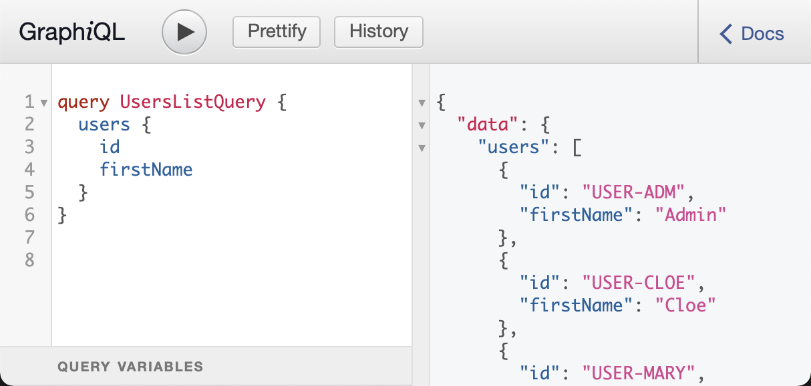

# 4. First Use Case

## 4f. Users Query

The last step to complete our API is the conversion of the use case result to the a GraphQL response. GraphQL is strongly typed so we first have to set up _types_ for every entity we want to expose. Then we need to set up a _resolver_ that calls the use case and converts the the returned domain entity objects to GraphQL types. And finally we have to expose the resolver as an endpoint in the GraphQL schema.

### GraphQL User Type

Let's take a look at how the user should be represented in the GraphQL _schema_:

```graphql
type User {
  id: ID!
  email: String!
  firstName: String!
  fullName: String!
  lastName: String!
}
```

The schema defines all types and type attributes that a client can query from the server. Our user should have an `id`, `email` and three name fields. All of them will be strings (`ID` is also a string but usually not displayed to the user).

All field on the User type have an exclamation mark at the end. This means that this field is 'required'. By default, GraphQL types can be set to `null` if a value can not be provided. While this is sometimes convenient it is much better for the consuming client to define all fields as required and provide a default value when necessary, like an empty string.

### Graphene User Class

To define a type with _Graphene_ we have to subclass `ObjectType` and define the desired attributes as _class attributes_. Graphene now will check if the data that is provided by the _resolver_ has those attributes and return the attributes values. In our case the data is a domain _User_ entity object.

By default _Graphene_ translates Python _snake_case_ notation to GraphQL _camelCase_ so we can use Python naming conventions. We set the `required` option on all of them. We won't have any problems with this because our User entity provides all these fields.

The only exception to this is the `full_name` attribute. We have to define a custom resolver for this field. Field resolvers are implemented as a _static_ method on the class and receive a `parent` as first argument. The `parent` will be the user entity returned by the resolver. So we can use the entity's `first_name` and `last_name` attributes to create the value for `full_name`.

Note that we do not define `is_admin` or `organisation_id` on the User type. These are attributes that we use internally in our domain use cases but we do not want to expose them via the API.

```python
# app/adapters/graphql/types/users.py
import graphene

from app.domain.users.entities import User as UserEntity

class User(graphene.ObjectType):
    class Meta:
        description = "A User type"

    id = graphene.ID(required=True)
    email = graphene.String(required=True)
    first_name = graphene.String(required=True)
    last_name = graphene.String(required=True)
    full_name = graphene.String(required=True)

    @staticmethod
    def resolve_full_name(parent: UserEntity, info) -> str:
        return f"{parent.first_name} {parent.last_name}"
```

### Resolver function

Now we need a _resolver_ function that calls the _ListUsersUseCase_ from the GraphQL layer. This could be a simple two-liner if the use case didn't depend on the service and the service didn't depend on the repository. So in order to call the use case we first need to:

1. define (or import) a configuration object for the repository
2. import the user repository and create an instance with the configuration as argument
3. import the user service and create an instance with the user repository as argument
4. create an instance of the use case with the user service as argument
5. call the use case's `execute` method

Here is the code for this:

```python
# app/adapters/graphql/resolvers/users.py

from typing import List

from app.domain.users.entities import User
from app.domain.users.use_cases import (
    ListUsersUseCase,
)

# don't get attached - this is just temporary
from app.adapters.repositories.users.memory_user_repository import MemoryUserRepository
from app.domain.users.service import UserService

config_with_users = {
    "environment": "test",
    "repositories": {
        "fixtures": {
            "users": "tests/fixtures/users.json",
        }
    },
}


async def list_users() -> List[User]:
    """call use case and convert user entities to GraphQL Users"""
    tmp_user_repo = MemoryUserRepository(config=config_with_users)
    tmp_user_service = UserService(repository=tmp_user_repo)

    use_case = ListUsersUseCase(user_service=tmp_user_service)
    return await use_case.execute()
```

I set up the configuration locally because I want to use our fixtures files so there is something to return when we test the GraphQL endpoint.

Apart from that you may think that doesn't look too bad. It certainly looks like a lot of Python code I come across. But consider that we will have to repeat this setup for every resolver and that a use case may require more than one service.

While this is all doable, we will see in the next chapter that Dependency Injection is a much more elegant solution for this problem. For now, this is good enough to let us test drive our resolver.

### _users_ Query Endpoint

The final piece in our GraphQL API is an `endpoint` that a client will query to get the list of users. The schema defines a top-level list of entry points that expose the primary types. Typically this is called the `Query` type in the schema. We already have a `healthcheck` endpoint from our initial GraphQL setup. Now we want to add a `users` endpoint that will return the list of users:

```graphql
type Query {
  healthcheck(name: String = "GraphQL"): String
  users: [User!]!
}
```

You can see that both the returned list as well as the `User` type in the list are marked as required. For the client that means that a request will always return a list and every element in the list will be a User (or the list is empty). If the resolver doesn't provide a response that matches these requirements it is considered an error and the request will fail.

To define this schema with _Graphene_ we have to define the _users_ field on the Query class like this:

```python
    users = graphene.List(graphene.NonNull(types.User), required=True)
```

We can't use the `required` argument for the User type so we have to use the `NonNull` type modifier. The corresponding field resolver simply calls the `list_users` function we have set up in `resolvers`. All resolvers and GraphQL types are imported in the folder's `__init__` files so we can conveniently import them as collections.

The updated `Query` definition looks like this:

```python
# app/adapters/graphql/query.py
import graphene

from . import resolvers
from . import types

class Query(graphene.ObjectType):

    healthcheck = graphene.String(name=graphene.String(default_value="GraphQL"))

    users = graphene.List(graphene.NonNull(types.User), required=True)

    @staticmethod
    def resolve_healthcheck(parent, info, name):
        return f"Hello {name}!"

    @staticmethod
    async def resolve_users(parent, info):
        return await resolvers.list_users()
```

With that our code is complete to process a GraphQL request for `users`. In the _repo root folder_ start the Docker container and open the _GraphiQL_ web interface at _http://localhost:4000/graphql_. Type a query for the `users` endpoint and check that there are users returned for it.



### Testing

Our GraphQL resolvers are not implementing any logic so we do not need to iterate over input variations in unit tests. We can just set up integration tests that exercise the full stack. When the result is correct we know our resolvers are set up correctly.

Following the example from the `healthcheck` query we can set up a test to query the `users` endpoint and compare the result with our test data set. Remember that the fixtures are currently still hard-coded in the resolver dependencies.

```python
# tests/integration/graphql/users/test_users_query.py

class TestGraphQLHealthCheckQuery:
    """GraphQL.query.users"""

    query = "query QueryUsers { users { id email } }"

    def test_query_users_list(self, client, all_users):
        """[GQL-US-000] returns all users"""

        json = {"query": self.query}
        response = client.post("/graphql", json=json)

        assert response.status_code == 200

        # confirm that all users have been returned
        result = response.json()
        assert len(result["data"]["users"]) == len(all_users)
```

With our docker container still running we can execute the test:

```
$ docker-compose exec web python -m pytest -k test_query_users_list
```
