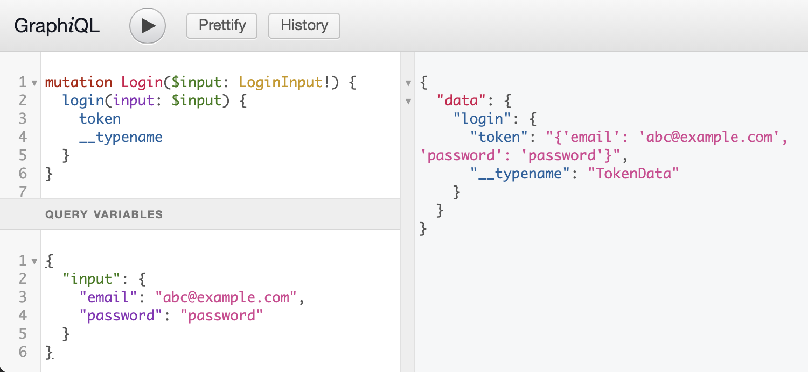

# 6a. Authentication Token

So far our application does not know who makes a request. Our business logic will mostly be around user permissions so we will have to add a way for the user to identify themselves to the system. We will use JWT tokens for this.

You can read more about JWT tokens on [jwt.io](jwt.io).

As a first step, we need to add a way for the user to authenticate to the server and receive a token in return. The server adds a cryptographic signature to the token so when a user sends us a token along with a later request we can verify its contents and the claims within.

## LoginUseCase

The entry point for logging in to our system is the `LoginUseCase`. Regardless of the access layer (cli, REST, GraphQL) all implementations will call this use case to receive an access token.

The use case itself then calls an `authenticate_user` method that is implemented by the `AuthService`. This service does not provide data access like the `UserService` but implements logic that is shared between several use cases. Here we use it to keep all authentication related logic in one place.

Data is provided and returned in the form of _Data Transfer Objects_ (DTOs). These are just like other domain entities but their use is limited to pass data from one function to another, usually across domain boundaries. For the login we expect to receive a `LoginInputDTO` with the user's email and password. When successful, we return a `TokenDataDTO` that contains the generated token.

```python
# app/domain/auth/entities.py
from pydantic import BaseModel

class LoginInputDTO(BaseModel):
    email: str
    password: str

    class Config:
        allow_mutation = False

class TokenDataDTO(BaseModel):
    token: str

    class Config:
        allow_mutation = False


# app/domain/auth/use_cases/login.py
class LoginUseCase:
    """process user login"""

    @inject
    def __init__(
        self,
        auth_service: AuthServiceInterface = Provide[AppDependencies.services.auth_service],  # type: ignore
    ):
        self.auth_service: AuthServiceInterface = auth_service

    async def execute(self, login_input: LoginInputDTO) -> TokenDataDTO:
        """verify login credentials and return token data"""
        return await self.auth_service.authenticate_user(login_input)
```

As with all use cases, we rely on Dependency Injection to provide an instance of the `AuthService` to the `LoginUseCase`. All we need to do is to add the necessary markers and set up the factory as `auth_service` in the `services` dependency container.

## Authentication Service

Like the use case the `AuthService.authenticate_user` method receives a `LoginInputDTO` and returns a `TokenDataDTO`. The interface definition looks like this:

```python
# app/domain/auth/interfaces.py
import abc
from typing import Optional

from .entities import LoginInputDTO, TokenDataDTO

class AuthServiceInterface(metaclass=abc.ABCMeta):
    """test comment"""

    @abc.abstractmethod
    async def authenticate_user(self, input: LoginInputDTO) -> TokenDataDTO:
        """authenticate user via email and password and return auth token"""
        raise NotImplementedError
```

### Authenticating the user

For the authentication the user data is represented by an `AuthUser` entity. This entity includes the hashed password and only the attributes we want to include in our token. I use this entity instead of the existing `User` entity because I don't want to expose the user's password hash in any other areas other than those related to authentication.

```python
# app/domain/users/interfaces.py

class AuthUser(BaseModel):
    """limited user data object with password hash"""

    id: str
    email: str
    password_hash: str
    organization_id: str
    is_admin: bool

    class Config:
        allow_mutation = False
```

To lookup a user by email and get an instance of the `AuthUser` entity we need to add a new method to our `UserRepository`. We begin with the `UserRepositoryInterface`:

```python
# app/domain/users/interfaces.py
    @abc.abstractmethod
    async def get_auth_user_by_email(self, email: str) -> Optional[AuthUser]:
        """find and return one user via the user's email address"""
        raise NotImplementedError
```

Because our `UserServiceInterface` is based on the repository it will inherit this method, too, and we have to provide implementations in both the `UserService` and the `MemoryUserRepository`:

```python
# app/domain/users/service.py
    async def get_auth_user_by_email(self, email: str) -> Optional[AuthUser]:
        """find and return AuthUser via the user's email"""
        return await self._repository.get_auth_user_by_email(email)

# app/adapters/repositories/users/memory_user_repository.py
    async def get_auth_user_by_email(self, email: str) -> Optional[AuthUser]:
        """find and return one user via the user's email address"""
        users = filter_entities_by_attributes(self._users, {"email": email})
        return AuthUser(**users[0]) if len(users) > 0 else None
```

To begin the actual implementation of the `authenticate_user` method we need to install a few libraries to handle the password encryption and token generation:

```
(venv) $ pip install 'python-jose[cryptography]'
(venv) $ pip install passlib
(venv) $ pip install bcrypt
(venv) $ pip freeze  > requirements.txt
```

I have based the implementation on a FastAPI tutorial. Feel free to look
it up for more details:

    https://fastapi.tiangolo.com/tutorial/security/oauth2-jwt/

For the moment we are only interested in the `AuthService` class itself and the `authenticate_user` method.

```python
# app/domain/auth/service.py

class AuthService(AuthServiceInterface):
    """provides user authentication logic"""

    def __init__(self, repository: UserRepositoryInterface, config: Any):
        self.repository = repository
        self.config = config

    async def authenticate_user(self, input: LoginInputDTO) -> TokenDataDTO:
        """validate user's login data and return session token data"""
        user = await self.repository.get_auth_user_by_email(input.email)
        if not user:
            raise AuthError()

        verified = verify_password(input.password, user.password_hash)
        if not verified:
            raise AuthError()

        token = self.get_token(user)
        return TokenDataDTO(token=token)

    def get_token(self, user) -> str:
        """create token with user data as payload"""
        payload = {"sub": user.id, "user": get_token_user(user)}

        return create_access_token(payload, self.config)
```

The first two blocks in the `authenticate_user` method lookup the user and validate the provided password against the stored password hash. If there is no user or the password does not match we raise a custom `AuthError` with a message to inform the user.

If the user has been authenticated we generate a password based on the user's data. We use the `get_token_user` function to filter the user attributes that we want to include in the token. The token generation is handed to a dedicated method (`get_token`). This is not only cleaner but it also gives us a way to generate tokens for our tests.

### Dependency setup

To set up the service factory we define an `auth_service` in our `Services` dependency container.

```python
# app/domain/services.py
class Services(containers.DeclarativeContainer):

    config = providers.Configuration()
    repositories = providers.DependenciesContainer()

    auth_service = providers.Factory(
        AuthService,
        repository=repositories.user_repository,
        config=config.services.auth,
    )

    user_service = providers.Factory(
    ...
```

Note that we have to add a `config` placeholder as well because our
service requires the `services.auth` section of the configuration object. We already have the basic settings in our `config.py` file:

```python
base_configuration = {
    # ... other settings
    "services": {
        "auth": {
            "algorithm": "HS256",
            "secret": "this must be overridden by env variable",
            "token_ttl": 3600,
        }
    },
}
```

The `secret` is later replaced by an environment variable to make sure we are not relying on a value from our code base for this security sensitive area.

## Login Mutation

We still need to expose the `LoginUseCase` in our GraphQL schema.

Authentication via token is stateless. You do not need to keep track of the users who are currently accessing your system. Most real world applications will still implement some sort of session management and create a new session when a user logs in. To reflect this change in state user login is usually implemented as a GraphQL _mutation_.

### Schema

For a basic login schema we need to define an input and the mutation itself. I also added a `TokenData` type for the login response. For one, this identifies the returned string clearly as `token` and it allows us to expand our response with a _refreshToken_ or user profile data if we need this in the future.

```graphql
type LoginInput {
  email: String!
  password: String!
}

type TokenData {
  token: String!
}

Mutation {
  login(input: LoginInput!): TokenData!
}
```

### Stub Implementation

The desired schema can be created with the Python code below. The GraphQL schema implementation is spread over three files but I copied the essential pieces into one code block. The logic is again delegated to a resolver which we will address later.

```python
# app/adapters/graphql/types/auth.py
import graphene

class LoginInput(graphene.InputObjectType):
    class Meta:
        description = "data required for a login request"

    email = graphene.String(required=True)
    password = graphene.String(required=True)

class TokenData(graphene.ObjectType):
    class Meta:
        description = "data returned after a successful login"

    token = graphene.String(required=True)


# app/adapters/graphql/types/auth_mutations.py
class LoginMutation(graphene.Mutation):
    class Arguments:
        input = LoginInput(required=True)

    Output = graphene.NonNull(TokenData)

    @staticmethod
    async def mutate(parent, info, input: LoginInput) -> TokenData:
        # TODO: call login resolver
        return TokenData(token=str(input))

# app/adapters/graphql/mutation.py
class Mutation(graphene.ObjectType):
    login = types.LoginMutation.Field()
```

The `LoginMutation` requires an `input` argument of type `LoginInput`. `LoginInput` is a GraphQL _input_ type that requires an `email` and a `password`. If we left out one of these, provided anything but a string or did not provide the `input` altogether the request would fail the GraphQL schema validation and we would receive an error.

By default, each mutation class in _Graphene_ creates a dedicated GraphQL type in the schema to represent the return value of the mutation. This is good practice because it keeps your schema open for later additions like custom error messages or processing stats.

For simple mutations, I prefer to return existing types to reduce the size of the schema. In the `LoginMutation` class I set the `Output` attribute to `graphene.NonNull(TokenData)` which means the mutation will return an instance of the `TokenData` type. I added the `NonNull` to mark it as required. After all, if the mutation doesn't produce a token something must have gone wrong.

Now we just need to include the new root `Mutation` type into the schema:

```python
# app/adapters/graphql/graphql_app.py
from .mutation import Mutation
from .query import Query

schema = graphene.Schema(mutation=Mutation, query=Query)
```

With this in place we can try the mutation in the GraphQL playground. Instead of a real token we will receive a string with our input variables until we complete the authentication resolver.



### Testing the requirements

It's time to catch up with our testing. To recap, our login sequence is this:

1. The (unknown) user sends a request to our `login` mutation endpoint and provides an email and password as input.
1. We look up the email address in our users service. If we can't find a corresponding user we return an `AuthenticationError`.
1. If we have found a user, the user's data will contain a password hash. We hash the password provided in the input and compare it with the stored hash. If hash does not match we return an `AuthenticationError`.
1. If the hashes match the user is authenticated. We generate a token with the user id (and other information) and send it back to the user.
1. If there are any errors while we process the password or token we return an error with the details.

We don't want to give away any details about our users so the error messages for 2 and 3 are the same. The processing error is different because we want to know what went wrong to start our debugging.

### Requirements

We can extract the following requirements from the above:

- `GQL-AU-001`: The system provides a `login` mutation endpoint that requires an email address (string) and password (string) as input.
- `GQL-AU-002`: On successful authentication the system returns a `token`.
- `GQL-AU-003`: The token payload contains the user's id and email.
- `GQL-AU-004`: When the authentication fails the user receives an `AuthenticationError`.
- `GQL-AU-005`: Processing errors are exposed to the user.

The first requirement is already document in the schema. Not providing the required input values would result in a validation error. But since we already have the setup to make requests with variables we can add a short test to include this requirement in our test output.

```python
# tests/integration/graphql/auth/test_login_mutation.py
from jose import jwt
from unittest.mock import patch

VALID_CREDENTIALS = {"email": "cloe@example.com", "password": "password"}

class TestGraphQLLoginMutation:
    """GraphQL.mutation.login"""

    login_mutation = """
    mutation Login($input: LoginInput!) {
        login(input: $input) {
            token
            __typename
        }
    }"""

    def make_login_request(self, client, input_vars=VALID_CREDENTIALS):
        """make a login request with valid email and password"""
        json = {
            "query": self.login_mutation,
            "variables": {"input": input_vars},
        }
        return client.post("/graphql", json=json)


    def test_login_mutation_requires_email_and_password(self, client):
        """[GQL-AU-01] requires email and password"""

        response = self.make_login_request(client, {"email": "cloe@example.com"})
        assert response.status_code == 400

        response = self.make_login_request(client, {"password": "password"})
        assert response.status_code == 400

        # confirm successful input combination
        response = self.make_login_request(client)
        assert response.status_code == 200
```

The `make_login_request` helper is set up with valid default credentials.
We can use it again to quickly a test for our next requirement:

> `GQL-AU-002`: On successful authentication the system returns a `token`.

```python
    def test_login_mutation_returns_token(self, client):
        """[GQL-AU-02] returns TokenData with a token (string) on success"""
        response = self.make_login_request(client)

        data = response.json()["data"]
        assert data["login"]["__typename"] == "TokenData"
        assert isinstance(data["login"]["token"], str)
```

### Resolver

We handle the request in the `login` resolver. Like before, we will set up a `LoginUseCase` for the logic and the resolver only needs to call the use case and convert the data from the GraphQL input _type_ to the domain DTO _entity_.

At first it may look a bit strange that we convert the `LoginInput` type to the `LoginInputDTO` object, although they have the same attributes. Keep in mind, thought, that this is a very simple example. In a more complex mutation the input objects could look different. For example, the resolver could inject the user id or the current date that the GraphQL input type does not provide.

Another reason to do the conversion is object typing: If your code editor supports type hints you would get warnings about the use of incorrect types. They may have the same attributes, but for the type checker they are two distinct types.

```python
# app/adapters/graphql/resolvers/auth.py
from app.domain.auth.entities import LoginInputDTO, TokenDataDTO
from app.domain.auth.use_cases import LoginUseCase

from ..types import LoginInput

async def login(input: LoginInput) -> TokenDataDTO:
    login = LoginUseCase()
    login_input = LoginInputDTO(email=input.email, password=input.password)

    return await login.execute(login_input)
```

The resolver returns the `TokenDataDTO` that is returned from the use case. That means that we have to convert the DTO to the GraphQL `TokenData` type in the resolver. The complete `mutate` method of the `LoginMutation` class looks like this:

```python
    @staticmethod
    async def mutate(parent, info, input: LoginInput) -> TokenData:
        data: TokenDataDTO = await resolvers.login(input)
        return TokenData(token=data.token)
```

It's time to test the token implementation.

## Testing the login mutation

For a quick visual test we can run our GraphQL playground login mutation and copy the returned token and paste it in the validation area at [jwt.io](jwt.io). The decoded payload shows us the user data included in the token.


To test this programmatically, we need to complete the login like in the previous tests and decode the token we receive in the response. Luckily, we can decode the token without knowing the signing key:

```python
    def test_login_mutation_token_includes_user_data(self, client):
        """[GQL-AU-03] token payload contains the user's id and email"""
        response = self.make_login_request(client)

        data = response.json()["data"]
        token = data["login"]["token"]

        options = {"verify_signature": False}
        decoded = jwt.decode(token, "", options=options)

        assert decoded["user"]["id"] == "USER-CLOE"
        assert decoded["user"]["email"] == "cloe@example.com"
```

For the next test we can simply provide a wrong email and wrong password variation of the login credentials and check the returned error message:

```python
    def test_login_mutation_auth_error_message(self, client):
        """[GQL-AU-04] user receives AuthenticationError"""
        variations = [
            {"email": "NO_SUCH_EMAIL@example.com", "password": "password"},
            {"email": "cloe@example.com", "password": "wrong_password"},
        ]

        for credentials in variations:
            response = self.make_login_request(client, credentials)

            error = response.json()["errors"][0]
            assert error["message"].startswith("AuthenticationError")
```

### Simulating exceptions

The final test is a bit more complicated. We need to simulate an exception in the `AuthService.authenticate_user` method. Python's `unittest` module provides the `patch` tool to replace functions in your code base during a test and to raise an exception as a _side effect_.

The only problem is to find the right place to apply the patch. For us this is the `di_containers.py` file where all the services are imported and set up as dependencies. To get access to the namespace we need to import the file in our test. A successful test with `patch` then looks like this:

```python
    def test_login_mutation_any_other_error(self, client):
        """[GQL-AU-05] Processing errors are exposed to the user"""

        expected = "Out of Cheese Error. Redo From Start."

        with patch(
            "app.domain.services.AuthService.authenticate_user",
            side_effect=Exception(expected),
        ):
            response = self.make_login_request(client)

            error = response.json()["errors"][0]
            assert error["message"] == expected
```

### AuthService unit tests and refactoring

To complete the test coverage we also need to add unit tests for the `AuthService` methods. These follow the same pattern as the `UserService` unit tests. We provide a mock for the `UserRepository` and a configuration object to create a service instance. When we need a specific response from the repository we can mock the repository method with `AsyncMock` and define a return value.

We already set up a `MockUserRepository` for the `UserService` tests. To avoid repeating it in the `AuthService` test file, we can move it to the `conftest.py` file and define a Pytest fixture to get a `mock_user_repository` instance.

## Next step

Now we can request a token from the server. It's the job of the client to add this token to any following request to prove the user's identity. In the next step we will implement the _middleware_ to extract this token (when provided) and add the user information to the request.
