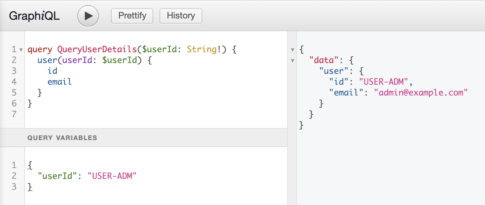

# 7. User Details Use Case

With the experience from the `ListUsersUseCase` we can now implement a new use case and GraphQL endpoint to show the details of a single user. To identify the user the client needs to provide the `id` of the user. The endpoint resolver will receive this id as a _query argument_ and has to provide it to the use case along with the current user.

## Requirements

Based on the requirements for `users` endpoint we can define the following requirements fot the `user` GraphQL endpoint:

- **[GQL-US-101]** `user` returns `null` when the querying user is not authenticated
- **[GQL-US-102]** `user` returns `null` when the user does not exist
- **[GQL-US-103]** `user` returns a single user when the user exists and the querying user is an admin
- **[GQL-US-104]** `user` returns a single user when the user exists and the querying user is in the same organisation
- **[GQL-US-105]** `user` returns `null` when the user exists but the querying user is in a different organisation

## First Test

Let's do some TDD and define our first test before we start the implementation. The test setup mirrors `GQL-US-001` (the first _list users_ test). This time our `query` string expects a variable of type `String!` (note the exclamation mark).

We also set up a class wide value for the user id with an id value that exists in our fixtures. Note that the key in the dict is called `userId` to match GraphQL conventions rather than Python. When we make our request we pass both the `query` and `variables` as json to the client.

```python
# tests/integration/graphql/users/test_user_query.py

class TestGraphQLUserDetailsQuery:
    """GraphQL.query.user"""

    query = "query QueryUserDetails($userId: String!) { user(userId: $userId) { id email } }"
    variables = {"userId": "USER-CLOE"}

    def test_query_user_details_without_token(self, client):
        """[GQL-US-101] returns None when queried without token"""
        json = {"query": self.query, "variables": self.variables}
        response = client.post("/graphql", json=json)

        assert response.status_code == 200

        result = response.json()
        assert result["data"]["user"] == None
```

While this test is formally correct, we have nothing in place to support it. This test will fail until we have updated the schema, added the resolver and a basic use case implementation. If you are not comfortable with GraphQL yet this may feel like flying blind and most of the time you won't get any useful error messages either.

You can add more tests, for example to inspect the schema to confirm that your type definition is correct. Or you can cheat and implement the full stack without authorisation check and use GraphiQL to make a manual query to confirm that everything is working. Do what feels right for you. I'm not judging.



## Schema

The requirements tell us that the endpoint returns either a `User` type or `null`. The definition for the query endpoint and the field resolver looks like this:

```python
# app/adapters/graphql/query.py

class Query(graphene.ObjectType):
    # [...]
    user = graphene.Field(types.User, user_id=graphene.String(required=True))

    @staticmethod
    async def resolve_user(parent, info, user_id):
        return await resolvers.get_user_details(info, user_id)
```

The result of the query is defined with `types.User`. There is no `required` attribute on this one because the lookup can fail and return `null`. To look up the user we _require_ an argument of type `String`. In Python the argument is called `user_id` but in the schema this will be translated to `userId`. Because it is `required` the client has to provide a value or it would be a schema error.

## Resolver

Graphene will call the `resolve_user` function with the `info` object and the `user_id` provided by the client. As before we pass these values to our `get_user_details` resolver function where we extract the current_user from the `info` and call the use case:

```python
# app/adapters/graphql/resolvers/users.py

async def get_user_details(info, user_id) -> Optional[User]:
    """get user details for user identified by user_id"""
    current_user = get_current_user(info)
    use_case = GetUserDetailsUseCase()
    return await use_case.execute(current_user, user_id)
```

## Use Case Stub

We can copy the setup for the use case from the `ListUsersUseCase`. Again we inject a `UserService` instance into the constructor to be able to search for a user later. (This violates the rules of TDD a bit but so much easier to copy than type).

We need to change the return type for the `execute` method from `List[User]` to `Optional[User]` because we only return a single user or `None`.

For now we implement the `execute` method simply by returning `None`.

```python
class GetUserDetailsUseCase:
    """return details of a single user"""

    @inject
    def __init__(
        self,
        user_service: UserServiceInterface = Provide[AppDependencies.services.user_service],  # type: ignore
    ):
        self.user_service = user_service

    async def execute(
        self, user_id: str, current_user: SessionUser = None
    ) -> Optional[User]:
        return None
```

Our first test will finally pass because `None` (or `null` in GraphQL) is what we expect as result. But we have not only confirmed that the use case returns `None`. We also show that the schema is defined correctly and that the resolver calls the use case to the get final result.

## Full Use Case

We can now iterate over our remaining requirements and implement test cases and incremental changes to the use case. I will skip over the tests (you can look them up in the repo) and just show the final implementation of the use case:

```python
# app/domain/users/use_cases/get_user_details.py

class GetUserDetailsUseCase:
    """return details of a single user"""

    @inject
    def __init__(
        self,
        user_service: UserServiceInterface = Provide[AppDependencies.services.user_service],  # type: ignore
    ):
        self.user_service = user_service

    async def execute(
        self, user_id: str, current_user: SessionUser = None
    ) -> Optional[User]:
        if not current_user:
            return None

        user = await self.user_service.get_user_by_id(user_id)

        if current_user.is_admin:
            return user

        if user.organization_id == current_user.organization_id:
            return user

        return None
```

Again the logic can be implemented with a few simple conditions. We also add a final `return None` in case none of the other conditions are met.

Because the use case implements our logic we should add unit tests as well. In the unit tests we want to test all logical combinations that the use case might have to deal with. It is much easier to do this with mocked dependencies rather than the full stack and the tests will run faster, too.

The value of these permutation tests is demonstrated here when we try to query user details with an non-existent user id as regular user. The code above will raise an exception and we have to update the last condition of our logic to take into account that the `user` might be `None`:

```python
    async def execute(...):
        # [... other conditions]

        if user and user.organization_id == current_user.organization_id:
            return user
```

Never underestimate the value of a good test coverage!
